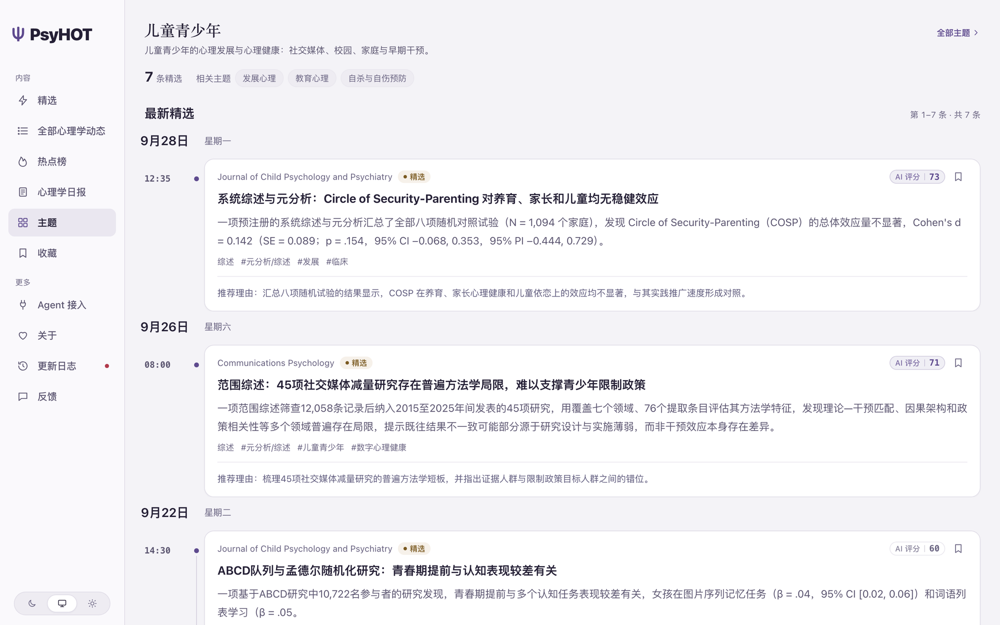
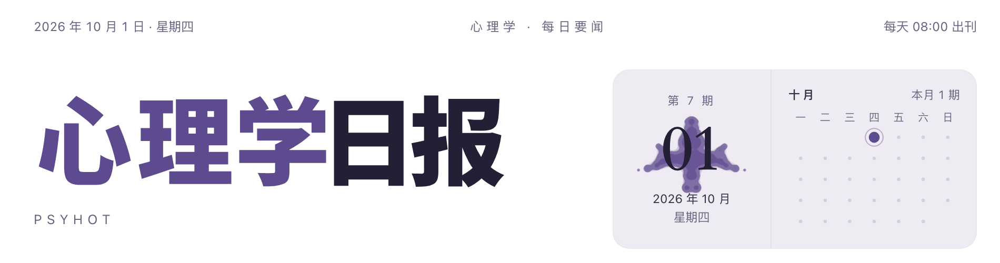

<p align="center">
  
</p>

<h1 align="center">PsyHOT</h1>

<p align="center">
  <b>每天读完心理学和精神医学的新研究，挑出值得看的几条。</b><br>
  期刊、预印本、学会和媒体，61 个公开信源；模型筛选、两次独立评分、中文摘要，每天早上 8 点出一份心理学日报。
</p>

<p align="center">
  <a href="LICENSE"></a>
  
  
  <a href="https://github.com/KKKKhazix/AIHOT"></a>
</p>

<p align="center">
  在线站点：<a href="https://psyhot.cn"><b>psyhot.cn</b></a>
</p>

<p align="center">
  <a href="#跑起来">跑起来</a> ·
  <a href="#它怎么挑">它怎么挑</a> ·
  <a href="#信源">信源</a> ·
  <a href="#调整口味">调整口味</a> ·
  <a href="#免责声明">免责声明</a>
</p>

<picture>
  <source media="(prefers-color-scheme: dark)" srcset="docs/assets/psyhot-home-dark.png">
  
</picture>

## 这是什么

心理学的新研究每天散落在几十本期刊、预印本服务器、学会官网和科普媒体里，其中大部分是窄范式的小改进、横断面的小样本相关，或者夸大了结论的新闻稿。PsyHOT 替你把这些都读一遍，只把真正值得知道的几条写成中文标题和摘要，放到首页和每天的日报里。

它面向有专业基础、时间有限的读者：心理咨询师与治疗师、精神科与临床工作者、心理学研究者和学生。

PsyHOT 基于 [AIHOT](https://github.com/KKKKhazix/AIHOT) 开源框架改造。框架负责采集、精选、聚簇、热度和日报；本仓库把信源、分类、提示词和视觉都换成了心理学方向。

## 它怎么挑

一条资料从信源进来，依次经过：

1. **采集与判重**：RSS、网页列表和接口，同一篇只留一份。新信源第一次只导入最近几条，旧文按原文时间归档，不刷屏。
2. **预筛**：是不是心理学、精神医学或心理健康的事。星座、塔罗、伪心理测试、借“心理学”包装的情感营销直接拦下；神经科学和遗传研究要落到情绪、认知、行为或心理障碍上才放行。
3. **两次独立评分**：同一份评分标准独立打两次分，两次之和过门槛才进精选。标准把每条内容归到 7 种类型（研究发现、元分析与综述、重复验证、临床与治疗、政策与行业、方法与工具、观点与解读），按 5 个维度加权：
   - **证据强度**按研究设计判断：随机对照、预注册、大样本、纵向、成功的重复验证和高质量元分析证据强；横断面相关、小样本、只有自评问卷、只在动物上的结果、只有新闻稿转述的结论证据弱。
   - **要压住的噪声**：心灵鸡汤、贩卖焦虑的流行概念、机构和课程营销、把相关写成因果的“研究发现”、细分范式里的小幅改进。
   - **要正常评价的价值**：改写认识的大研究、高质量元分析、经典效应的重复验证（包括“没能重复”）、DSM 与 ICD 的修订、临床指南、精神科新药与神经调控的关键试验、心理健康政策和科研诚信事件。
4. **写作**：中文标题、答案先行的摘要、推荐理由和标签，外文全文翻译。写作规则要求保留原文的结论强度，相关不写成因果；涉及自杀和自伤的内容按世界卫生组织的报道指南来写，也不写成个人诊疗建议。
5. **聚簇**：同一项研究的期刊原文、新闻稿和媒体报道归成一个事件；预印本和正式发表、论文和针对它的评论挂在同一条故事线上。
6. **热点与成刊**：按独立来源数算热度；每天 08:00 出日报，每周一出周报，每月 1 日出月报。

每一步的提示词原文都在 [`industry/prompts/`](industry/prompts/)，入选门槛在 [`industry/selection.ts`](industry/selection.ts)，改标准不用改代码。

<p align="center">
  
</p>

每一期日报的报眼里都有一张由这一期的日期生成的罗夏墨迹，每期都不一样。

## 信源

61 个公开信源，全部用项目自己的抓取代码验证过能抓到、最近仍在更新。期刊和机构官网是 T1，预印本和媒体是 T2（预印本没有经过同行评审，入选门槛更高）。站内默认只显示摘要和原文链接。

| 方向 | 信源 |
|---|---|
| 综合与综述 | Nature Human Behaviour、Communications Psychology、Nature Reviews Psychology、Psychological Science、Perspectives on Psychological Science、Current Directions in Psychological Science、Psychological Science in the Public Interest |
| 精神医学与心理健康 | The Lancet Psychiatry、JAMA Psychiatry、American Journal of Psychiatry、World Psychiatry、Nature Mental Health、Biological Psychiatry、Psychiatric News |
| 临床、治疗与咨询 | Clinical Psychological Science、Clinical Psychology Review、Behaviour Research and Therapy、Psychotherapy Research、Counselling and Psychotherapy Research、Journal of Counseling & Development |
| 认知 | Trends in Cognitive Sciences、Cognition、Cognitive Psychology、Cognitive Science |
| 社会、人格与跨文化 | Personality and Social Psychology Review、Journal of Experimental Social Psychology、Journal of Cross-Cultural Psychology |
| 发展与教育 | Developmental Science、Journal of Child Psychology and Psychiatry、Autism、British Journal of Educational Psychology、Learning and Instruction、Contemporary Educational Psychology、Educational Psychologist、npj Science of Learning |
| 生理、神经与进化 | Psychoneuroendocrinology、Nature Neuroscience、Evolution and Human Behavior |
| 组织、健康、积极与司法 | Journal of Organizational Behavior、Personnel Psychology、Health Psychology Review、The Journal of Positive Psychology、Legal and Criminological Psychology、Psychology, Crime & Law、Criminal Justice and Behavior |
| 方法、元科学与科研诚信 | Advances in Methods and Practices in Psychological Science、Center for Open Science、Data Colada、Retraction Watch |
| 预印本 | PsyArXiv、medRxiv 精神医学与临床心理 |
| 学会、政策与媒体 | Association for Psychological Science、KFF Health News（心理健康）、PsyPost、ScienceDaily（心理学）、Psyche、Greater Good、The Transmitter |
| 中文 | 《心理学报》、《心理科学进展》、中国心理卫生协会 |

完整配置见 [`industry/sources.json`](industry/sources.json)。还缺的：中文媒体和学会的动态多发在公众号上（需要付费的公众号接口），NIMH、SAMHSA 等美国政府站点在部分网络下无法访问。欢迎补充，见 [贡献说明](CONTRIBUTING.md)。

## 跑起来

需要 [Docker](https://docs.docker.com/get-docker/) 和一个 OpenAI 兼容的模型 API Key（DeepSeek、千问、智谱都可以）。

```bash
git clone https://github.com/zhangheqing11/PsyHOT.git psyhot
cd psyhot
node scripts/init-env.ts --llm-key <你的模型 API Key>
docker compose up -d --build
```

打开 <http://localhost:3000>，后台在 `/admin`，管理员密码在 `.env` 的 `ADMIN_PASSWORD` 里。第一次导入的资料大约要处理半小时到一小时。

几个注意事项：

- **在中国大陆运行**：SAGE、OSF（PsyArXiv）等海外信源可能被 DNS 污染挡住，在 `.env` 里设置 `EGRESS_PROXY_URL` 指向你的代理（容器里用 `http://host.docker.internal:<端口>`）。
- **思考模式**：默认关闭（`LLM_EXTRA_JSON={"thinking":{"type":"disabled"}}`）。全局打开会让评分等步骤的输出被思考占满而失败；想让评分用思考模式，设置 `SCORE_MODEL=deepseek-flash-think` 并填 `DEEPSEEK_BASE_URL`、`DEEPSEEK_API_KEY`。
- 不用 Docker、配域名和 HTTPS、费用估算，见 [部署](docs/deploy.md)。

## 调整口味

要改的东西几乎都在 [`industry/`](industry/)：

| 文件 | 内容 |
|---|---|
| `site.ts` | 站名、首页和关于页文案 |
| `taxonomy.ts`、`topics.json` | 6 个分类（研究、综述、临床、行业、方法、观点）、标签词表、机构名录、58 个主题页 |
| `sources.json` | 信源 |
| `prompts/` | 预筛、评分、写作、聚簇、日报的提示词；`rules-mental-health-safety.md` 是心理健康内容的安全写作规则 |
| `selection.ts` | 入选门槛 |
| `brand/`、`pages/` | 图标、报头字、使用规则和隐私说明 |

**入选门槛还需要校准**：现在的数字沿用框架在 AI 领域的默认值。跑几天之后，从自己的信源里挑 100–200 条资料标注“该选 / 不该选”，用 `scripts/eval-selection.ts` 评测，再调整评分标准和门槛，做法见 [精选与校准](docs/selection.md)。

视觉方面，配色、字体和圆角都在 [`apps/web/app/app.css`](apps/web/app/app.css) 的设计变量里；罗夏墨迹由 [`apps/web/app/components/inkblot-shape.ts`](apps/web/app/components/inkblot-shape.ts) 按种子生成。

## 免责声明

PsyHOT 汇总的是研究和行业动态，只用于了解领域进展，不构成医疗、诊断、心理咨询或治疗建议，也不能替代专业人员的评估。标题和摘要由模型生成，可能有误，请以原文为准。

如果你或身边的人正处于危机中，请立即拨打 120 或 110，或拨打全国统一心理援助热线 **12356**。

## 文档

`docs/` 下是 AIHOT 框架的文档，同样适用于本项目：[定制](docs/customize.md) · [信源](docs/sources.md) · [精选与校准](docs/selection.md) · [事件归组](docs/grouping.md) · [部署](docs/deploy.md) · [架构](docs/architecture.md)。改代码前先读 [AGENTS.md](AGENTS.md)。

技术栈：Node.js 24 · TypeScript · React Router（服务端渲染）· Fastify · PostgreSQL · pg-boss · Tailwind CSS · Docker Compose。内部包名沿用 `@aihot/*`，方便合并上游更新。

## 致谢与许可

感谢 [数字生命卡兹克](https://github.com/KKKKhazix) 开源 [AIHOT](https://github.com/KKKKhazix/AIHOT)，PsyHOT 的整个处理流程都建立在它之上。

代码使用 [MIT 许可证](LICENSE)。AIHOT 的名字和 Logo 不在许可范围内，PsyHOT 没有使用它们；字体和第三方标志的许可见 [NOTICE](NOTICE)。信源内容的版权归各来源所有。

---

<sub>**In English:** PsyHOT is a daily digest of psychology and psychiatry research. It reads 61 public sources (journals, preprint servers, societies and media), filters and scores every item twice with a language model against an evidence-aware rubric, writes Chinese headlines and summaries under mental-health-safe writing rules, clusters coverage of the same study into one story, and publishes a daily briefing. It is built on the open-source [AIHOT](https://github.com/KKKKhazix/AIHOT) framework; everything specific to psychology lives in `industry/`. Not medical advice.</sub>
